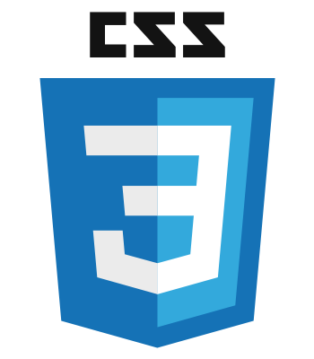
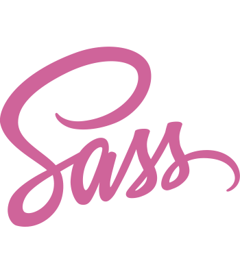
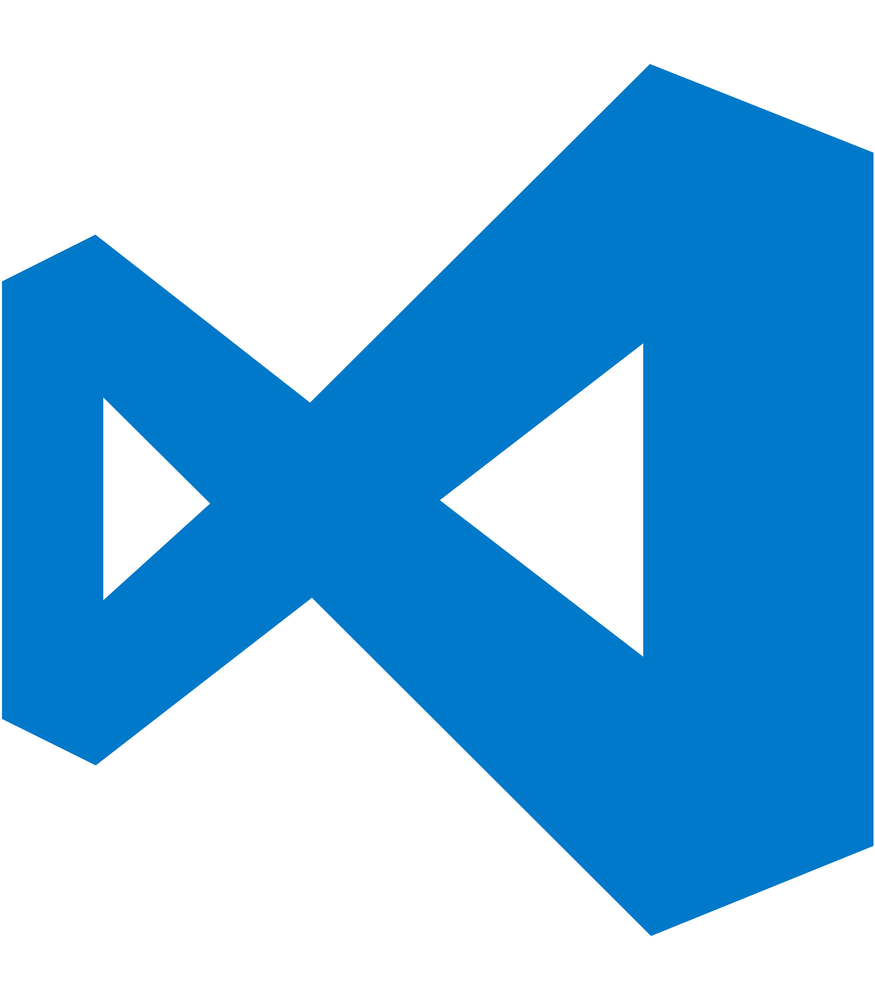

### Hello ${ Friend } ✨
 
 

## My name is [Jen Luu](https://jenCodes.com) & I am a Web Developer 👩🏻‍💻

<!-- - 💭 I’m currently working on ...
- 🌱 I’m currently learning ...
- 👩🏻‍💻 I'm employed at ... -->
- 📫 Email me: jennifer-luu@outlook.com
<!-- - 🧘🏻‍♀️ Pronouns: She/Her -->

## My Skills include: ✨
       

<!--
**luu-jennifer/luu-jennifer** is a ✨ _special_ ✨ repository because its `README.md` (this file) appears on your GitHub profile.

Here are some ideas to get you started:

- 🔭 I’m currently working on ...
- 🌱 I’m currently learning ...
- 👯 I’m looking to collaborate on ...
- 🤔 I’m looking for help with ...
- 💬 Ask me about ...
- 📫 How to reach me: ...
- 😄 Pronouns: ...
- ⚡ Fun fact: ...
-->
